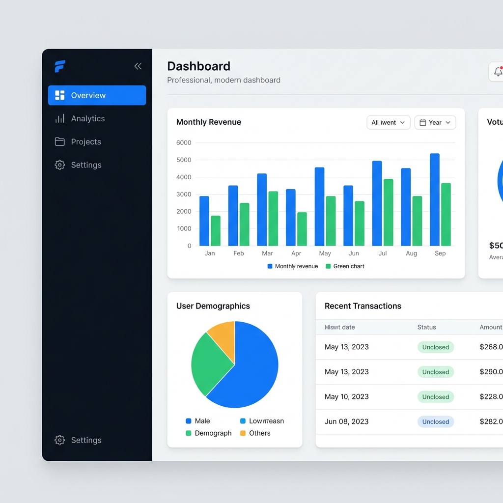

# zepdash-admin


**zepdash-admin** is a premium, lightweight, and modern admin dashboard template meticulously crafted with **Bootstrap 5**. It features a "Web 3.0" aesthetic with vibrant accents, soft layered shadows, and a clean interface designed for maximum productivity and ease of use.

---



---

## 🚀 Key Features

- **Standardized Navigation:** A consistent, accordion-based sidebar across all 20+ pages.
- **Modern UI Suite:** Leverages soft depth, glassmorphism, and a vibrant primary color palette.
- **20+ Ready-to-use Pages:** From complex form layouts to advanced data tables.
- **Interactive Data Visualization:** Seamlessly integrated with **Apache ECharts**.
- **Modern Syntax Highlighting:** Built-in **Prism.js** support with a custom-tuned light theme for documentation.
- **Responsive & Lightweight:** No jQuery, built with modern JavaScript and vanilla CSS variables.

---

## 🗺️ Comprehensive Menu Structure

### 🏠 1. Dashboard
- **index.html:** Main overview with interactive bar and pie charts, and key metric cards.

### 🧩 2. Components
Essential UI elements styled for a premium look:
- **Alerts:** Contextual feedback messages with icon support.
- **Badges:** Modern labels and status indicators.
- **Buttons:** Vibrant gradients, soft shadows, and tactile hover states.
- **Cards:** Clean content containers with floating hover effects.
- **Modals:** Flexible dialog prompts for user interaction.
- **Tabs & Accordions:** Smart content organization.
- **Progress Bars:** Smooth, animated progress indicators.
- **Toasts:** Modern notification popups.
- **Spinners:** Refined loading indicators.

### 📝 3. Forms
Comprehensive form controls for complex data entry:
- **Basic Inputs:** Text fields, textareas, and standard controls.
- **Select:** Custom-styled dropdowns and multi-select placeholders.
- **Checks & Radios:** Clean checkbox and radio button styles.
- **Form Layout:** Vertical, horizontal, and multi-column grid layouts.
- **Validation:** Modern client-side form validation examples.

### 📊 4. Tables
Data presentation at its best:
- **Basic Table:** Simple, clean, and responsive data rows.
- **DataTables:** Powerful integration for searching, sorting, and pagination.

### 📄 5. Pages
Ready-to-use application templates:
- **Authentication:** Login, Register, and Forgot Password.
- **Error States:** Custom-designed 404 and 500 error pages.

### 🛠️ 6. Utilities
Design tokens and helpful styles:
- **Colors:** Full color palette documentation.
- **Typography:** Modern typography system using the "Inter" font.
- **Icons:** High-quality icon set via **Phosphor Icons**.

---

## ⚙️ Built With

- **[Bootstrap 5](https://getbootstrap.com/)** - The world's most popular front-end toolkit.
- **[Phosphor Icons](https://phosphoricons.com/)** - A flexible icon family for interfaces.
- **[Apache ECharts](https://echarts.apache.org/)** - A powerful, interactive charting library.
- **[Prism.js](https://prismjs.com/)** - Lightweight, robust syntax highlighting.
- **[DataTables](https://datatables.net/)** - Exceptional table enhancement library.

---

## 🧩 Installation & Usage

### Quick Start
Clone the repository and open `index.html` in your browser:
```bash
git clone https://github.com/sepsu-dev/zepdash-admin.git
cd zepdash-admin
```

### Customization
The template uses CSS variables for easy branding. Modify strictly in `assets/css/styles.css`:
```css
:root {
  --zd-primary: #006fee;
  --zd-radius: 0.75rem;
  --zd-shadow: 0 4px 6px -1px rgba(0, 0, 0, 0.07);
}
```

---

## 📄 License
Distributed under the MIT License. See `LICENSE` for more information.